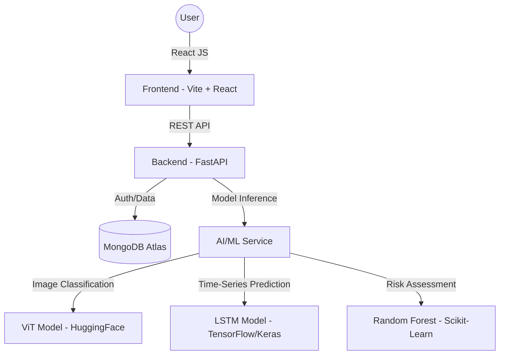

# BioSync - Personal Health Intelligence System (Codename: STOCKHOLM)

## Project Overview
BioSync is an end-to-end Personal Health Intelligence System built for the HBTU Campus Drive AI/ML Engineering Team Evaluation. Users can log daily activities (sleep, steps, meals), track health trends, and receive AI-driven insights through an integrated dashboard.

---

## Architecture Diagram
BioSync follows a modern client–server architecture designed to separate the user interface, application logic, and data management into independent layers. This structure improves scalability, maintainability, and performance. The system integrates lifestyle tracking, AI-powered analysis, and machine learning predictions to generate health insights for users.



The architecture consists of four primary layers:
1. **Frontend (Client Layer)**
2. **Backend (API Layer)**
3. **Database Layer**
4. **AI / Machine Learning Services**

### ML Implementation Details
BioSync integrates several machine learning models to provide deep insights:
- **Food Image Classification**: Uses a Vision Transformer (ViT) via HuggingFace Inference API to identify food items and estimate health advice.
- **Time-Series Activity Prediction**: Uses an LSTM model implemented with TensorFlow/Keras to forecast the next 7 days of user activity (steps, sleep).
- **Risk Scoring Model**: A Random Forest classifier implemented with Scikit-Learn that assesses user health risk based on historical logging patterns.
- **Input Data**: User-logged activity logs (steps, sleep), meal images, and nutritional data.
- **Output Results**: Food labels, 7-day predicted activity trends, and health risk levels (Low/Moderate/High).
- **Evaluation Metrics**: MSE for time-series predictions; Accuracy/F1-Score for classification models.
- **Failure Cases**: The system handles missing historical data by applying imputation (using population averages) to ensure continuous operation for new users.

---

## Tech Stack

### Frontend Layer
Responsible for the user interface, interaction, and dashboard visualization.
- **Core**: React, Vite
- **Networking**: Axios
- **Authentication**: JWT Authentication
- **Responsibilities**: User authentication (login/signup), activity tracking interface, meal image upload, dashboard visualization (using Recharts), displaying AI-generated health insights, and communicating with backend APIs.

### Backend Layer
A modular architecture providing high-performance asynchronous APIs for handling application logic and data processing.
- **Core**: FastAPI
- **Database**: MongoDB Atlas
- **Structure**: Modular layout (`auth/`, `activity/`, `meals/`, `dashboard/`, `health/`, `ml/`, `database/`) with separated `routes.py`, `service.py`, and `schemas/`.
- **Responsibilities**: Authentication and JWT validation, user data management, activity tracking logic, meal image processing, machine learning prediction execution, AI-generated health insights, and dashboard data aggregation.

---

## Setup Instructions

### Environment Setup
Create a `.env` file in the `Backend` directory:
```bash
MONGODB_URL=your_mongodb_url
SECRET_KEY=your_secret
HF_TOKEN=your_token
```

### Backend Setup
```bash
cd Backend
pip install -r requirements.txt
python -m uvicorn app.main:app --reload
```

### Frontend Setup
```bash
cd frontend
npm install
npm run dev
```

### How to Run
1. **Start Backend Server**:
   ```bash
   cd Backend
   python -m uvicorn app.main:app --reload
   ```
2. **Start Frontend Server**:
   ```bash
   cd frontend
   npm run dev
   ```
3. **Open Browser**:
   Visit [bio-sync-sandy.vercel.app](https://bio-sync-sandy.vercel.app) to access the application.

### Testing & Verification
To ensure system reliability and engineering discipline, several test suites have been implemented to verify core functionalities:
- **System Integration Test** (`test.py`): Verifies the end-to-end flow of the system (database connectivity, user registration/login, activity logging, and ML model inference). Run: `python test.py`
- **ML Logic & Data Processing Test** (`test_ml_logic.py`): Validates the mathematical and data-handling logic behind the AI services (unit tests for `safe_float` conversion, mock activity averaging, and data imputation logic). Run: `python test_ml_logic.py`
- **Security & Cryptography Test** (`test_auth_crypto.py`): Ensures the integrity of user data and secure communication (verifies password hashing, password matching logic, and JWT token generation). Run: `python test_auth_crypto.py`

---

## Team Roles
*(Add your team names and contributions here)*
- **AI/ML Specialist**: Developed LSTM and Risk Scoring models, integrated HuggingFace APIs.
- **Backend Lead**: Built the FastAPI server, designed the MongoDB schema, and implemented JWT authentication.
- **Frontend Lead**: Developed the React dashboard, interactive charts (Recharts), and image upload interface.
- **System Integrator**: Ensured seamless communication between the client, server, and ML models.
- **Documentation**: Drafted the project overview, API docs, and architectural decisions.

---

## API Documentation
The backend APIs are documented using FastAPI Swagger UI.


---

## Key Design Decisions (ADR)
1. **FastAPI for Backend**: Chosen for its high-performance asynchronous capabilities and automatic Swagger documentation.
2. **MongoDB Atlas**: Selected for its document-based flexibility, ideal for storing irregular time-series activity data and meal image metadata.
3. **LSTM for Prediction**: Decided to use LSTM (Long Short-Term Memory) networks over simple linear models to better capture temporal patterns in human activity.
4. **HuggingFace API Integration**: Leveraged pre-trained SOTA Vision models to provide high-accuracy food classification without the overhead of local vision model training.
5. **JWT for Security**: Implemented stateless JSON Web Token authentication for secure, scalable user management.
