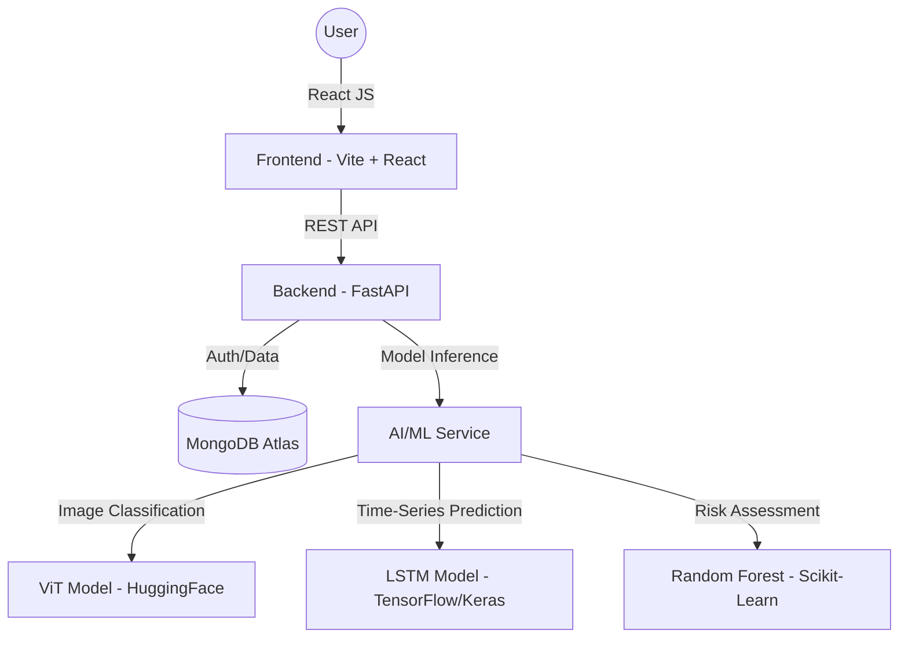

<<<<<<< HEAD
# BioSync – AI-Based Health Tracking System
## Project Overview

BioSync is an AI-powered health tracking system that monitors user lifestyle activities such as meals, physical activity, and daily habits to generate personalized health insights. The system integrates lifestyle tracking, AI-powered analysis, and machine learning predictions to help users understand and improve their health.

The platform uses a modern client–server architecture to ensure scalability, maintainability, and performance. BioSync provides a dashboard that visualizes health data and displays AI-generated recommendations.

## Architecture Diagram

BioSync follows a layered architecture consisting of four main layers:

### Frontend (Client Layer)
### Backend (API Layer)
### Database Layer
### AI / Machine Learning Services
### Architecture Flow

User → Frontend (React) → Backend (FastAPI) → Database (MongoDB)
                              ↓
                         AI/ML Services → Predictions → Backend → Frontend Dashboard
=======
# BioSync - Personal Health Intelligence System (Codename: STOCKHOLM)

## Project Overview
BioSync is an end-to-end Personal Health Intelligence System built for the HBTU Campus Drive AI/ML Engineering Team Evaluation. Users can log daily activities (sleep, steps, meals), track health trends, and receive AI-driven insights through an integrated dashboard.

---

# System Architecture
BioSync follows a modern client–server architecture designed to separate the user interface, application logic, and data management into independent layers. This structure improves scalability, maintainability, and performance
The system integrates lifestyle tracking, AI-powered analysis, and machine learning predictions to generate health insights for users.

### Architecture Diagram


The architecture consists of four primary layers:
### 1-Frontend (Client Layer)
### 2-Backend (API Layer)
### 3-Database Layer
### 4-AI / Machine Learning Services

BioSync integrates several machine learning models to provide deep insights:
- **Food Image Classification**: Uses a Vision Transformer (ViT) via HuggingFace Inference API to identify food items and estimate health advice.
- **Time-Series Activity Prediction**: Uses an LSTM model implemented with TensorFlow/Keras to forecast the next 7 days of user activity (steps, sleep).
- **Risk Scoring Model**: A Random Forest classifier implemented with Scikit-Learn that assesses user health risk based on historical logging patterns.

#### ML Implementation Details
- **Input Data**: User-logged activity logs (steps, sleep), meal images, and nutritional data.
- **Output Results**: Food labels, 7-day predicted activity trends, and health risk levels (Low/Moderate/High).
- **Evaluation Metrics**: MSE for time-series predictions; Accuracy/F1-Score for classification models.
- **Failure Cases**: The system handles missing historical data by applying imputation (using population averages) to ensure continuous operation for new users.

---

## Team Roles & Contributions
*(Add your team names and contributions here)*
- **AI/ML Specialist**: Developed LSTM and Risk Scoring models, integrated HuggingFace APIs.
- **Backend Lead**: Built the FastAPI server, designed the MongoDB schema, and implemented JWT authentication.
- **Frontend Lead**: Developed the React dashboard, interactive charts (Recharts), and image upload interface.
- **System Integrator**: Ensured seamless communication between the client, server, and ML models.
- **Documentation**: Drafted the project overview, API docs, and architectural decisions.

---

## Key Design Decisions (ADR)
1. **FastAPI for Backend**: Chosen for its high-performance asynchronous capabilities and automatic Swagger documentation.
2. **MongoDB Atlas**: Selected for its document-based flexibility, ideal for storing irregular time-series activity data and meal image metadata.
3. **LSTM for Prediction**: Decided to use LSTM (Long Short-Term Memory) networks over simple linear models to better capture temporal patterns in human activity.
4. **HuggingFace API Integration**: Leveraged pre-trained SOTA Vision models to provide high-accuracy food classification without the overhead of local vision model training.
5. **JWT for Security**: Implemented stateless JSON Web Token authentication for secure, scalable user management.

---

## 1. Frontend Layer
>>>>>>> 4d73fc72755da4545e8e279777073b005e05de25


## Technology Stack

### React
### Vite
### Axios
### JWT Authentication

## Responsibilities

#### User authentication (login / signup)
#### Activity tracking interface
#### Meal image upload
#### Dashboard visualization
#### Display AI-generated health insights
#### Communicate with backend APIs

The frontend sends HTTP requests to the FastAPI backend using Axios and includes the JWT token in request headers for secure communication.

## 1. Backend Layer

The backend is built using **FastAPI**, which provides high-performance asynchronous APIs for handling application logic and data processing.

### Responsibilities

- Authentication and JWT validation  
- User data management  
- Activity tracking logic  
- Meal image processing  
- Machine learning prediction execution  
- AI-generated health insights  
- Dashboard data aggregation  

The backend follows a **modular architecture** to keep the code organized and maintainable.

Example backend structure:

backend/
 ├── auth/
 ├── activity/
 ├── meals/
 ├── dashboard/
 ├── health/
 ├── ml/
 └── database/

 ## API Documentation

The backend APIs are documented using FastAPI Swagger UI.


Each module typically contains:

- `routes.py` – API endpoints  
- `service.py` – business logic  
- `schemas/` – request and response models

  

Added  setup instructions

## Backend Setup

```bash
cd Backend
pip install -r requirements.txt
python -m uvicorn app.main:app --reload
```


## Frontend Setup

```bash
cd frontend
npm install
npm run dev
```

## Environment Setup

Create a `.env` file in Backend:

```bash
MONGODB_URL=your_mongodb_url
SECRET_KEY=your_secret
HF_TOKEN=your_token
```


Added end-to-end project execution steps for frontend and backend

## How to Run

1. **Start Backend Server**:
   ```bash
   cd Backend
   python -m uvicorn app.main:app --reload
   ```
2. **Start Frontend Server**:
   ```bash
   cd frontend
   npm run dev
   ```
3. **Open Browser**:
   Visit [http://localhost:5173](http://localhost:5173) to access the application.


